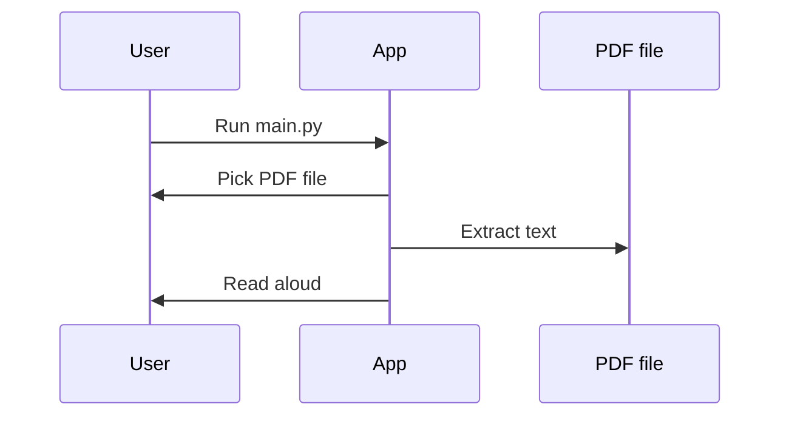

# 🎧 PDF-to-Audiobook

> **Effortlessly transform your PDFs into spoken audio — right on your desktop, all offline!**

---

## 🌟 Why PDF-to-Audiobook?

Have you ever wished you could listen to a PDF while doing chores, walking, or relaxing? **PDF-to-Audiobook** makes it possible in seconds. With a beautiful file picker, natural-sounding speech, and zero data ever leaving your device, it's the smart way to turn your reading into listening.

---

## ✨ Features

- **Super Simple:** Run, pick a PDF, and start listening.
- **No Internet Required:** Everything happens locally on your own computer.
- **Full Document Coverage:** Reads every page from start to finish.
- **Beginner-Friendly:** Minimal, readable code that you can customize instantly.
- **Privacy First:** Your files and voice never leave your machine.

---

## 🚀 Quickstart

1. Clone the repository:
    ```bash
    git clone https://github.com/ruthviksharma-d/PDF-to-Audiobook.git
    cd PDF-to-Audiobook
    ```
2. (Optional) Create a virtual environment:
    ```bash
    python -m venv venv
    # Activate on Windows:
    venv\Scripts\activate
    # Activate on Mac/Linux:
    source venv/bin/activate
    ```
3. Install the requirements:
    ```bash
    pip install pyttsx3 PyPDF2
    ```
4. Start the program:
    ```bash
    python main.py
    ```

---

## 📂 Folder Structure

```
PDF-to-Audiobook/
├── main.py
├── README.md
└── LICENSE
```

---

## 🤖 How Does It Work?

1. Pick a PDF file.
2. Extract text from each page.
3. Read the text aloud.

---

## 🪄 Simple Sequence Diagram



---

## 🛡️ License

Released under the [MIT License](LICENSE).  
Use, hack, and share — **just give credit!**

---

## 🤝 Contributions

Have an idea? Found a bug? Want a new feature?  
[Open an issue](https://github.com/ruthviksharma-d/PDF-to-Audiobook/issues) or send a pull request – all contributions welcome!

---

## ⭐️ Enjoying PDF-to-Audiobook?

If this tool helps you, don’t forget to **star** the repository!

---

<br>
<p align="right"><em>Made with ❤️ by ruthvik sharma</em></p>
